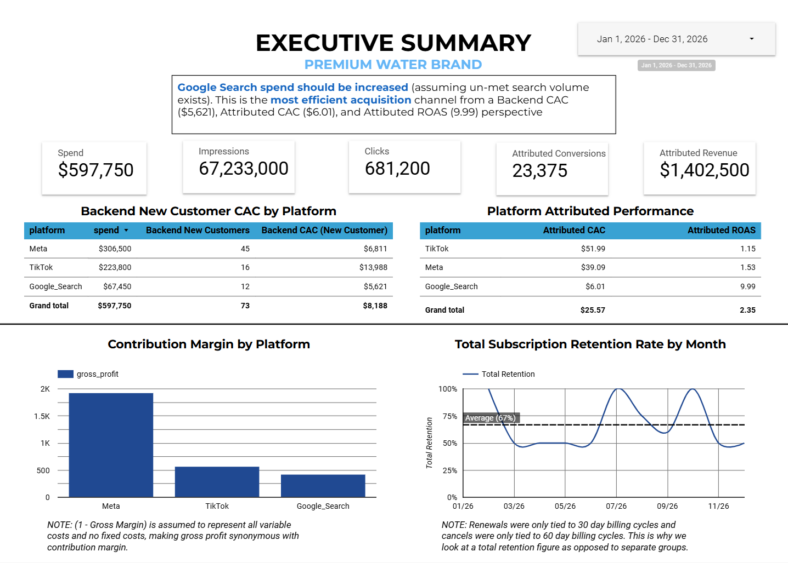
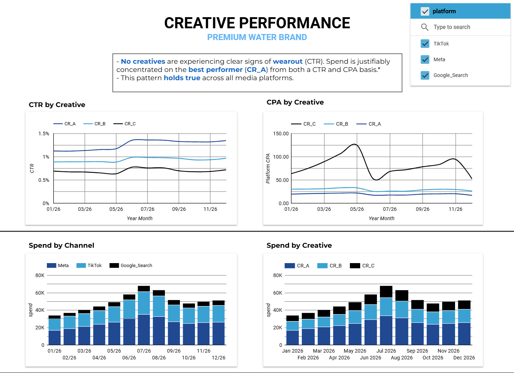
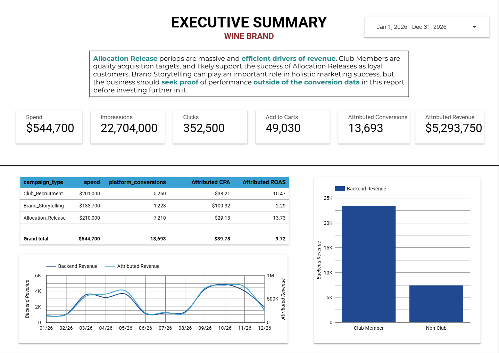
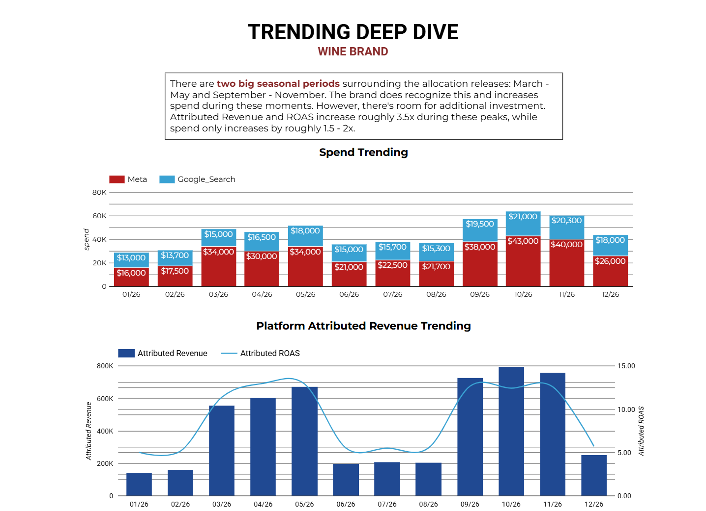

# Paid Media Performance Dashboard (Case Study)

This project analyzes paid media performance for two consumer brands using SQL (BigQuery) and Looker Studio.

The goal was to evaluate marketing efficiency, identify growth opportunities, and provide strategic recommendations based on campaign performance data.

---

## Dashboard

Executive dashboard built in Looker Studio analyzing:

- Customer Acquisition Cost (CAC)
- ROAS and revenue trends
- Contribution margin by platform
- Creative performance
- Subscription retention
- Seasonal revenue patterns

### Dashboard Screenshots

Water Brand Executive Summary  

Water Band Creative Performance Analysis  

Wine Brand Executive Summary  

Wine Deep Dive Analysis  

---

## SQL Data Preparation

Raw marketing and backend order data were transformed in BigQuery to create analysis-ready tables.

Key transformations included:

- Standardizing platform naming conventions
- Creating monthly aggregation fields
- Identifying new vs repeat customers
- Preparing subscription event data for retention analysis
- Cleaning inconsistent campaign and platform values

SQL files used for data preparation are located in the `sql/` folder.

---

## Key Insights

**Water Brand**

- Creative A consistently outperformed other creatives across platforms with no evidence of fatigue.
- Meta and Google Search delivered the most efficient customer acquisition.
- TikTok showed significantly higher CAC relative to other channels.

**Wine Brand**

- Google Search and Meta showed similar acquisition efficiency.
- Revenue spikes strongly aligned with allocation release periods, suggesting demand is event-driven rather than purely media-driven.

---

## Limitations

- Backend order attribution represents only a subset of total platform-reported conversions.
- Platform attribution models likely overstate individual channel performance due to last-touch attribution.
- Subscription retention analysis was constrained by limited renewal event data.

---

## Tools Used

- **BigQuery** — data transformation and modeling  
- **SQL** — data cleaning and aggregation  
- **Looker Studio** — dashboard visualization
=======

